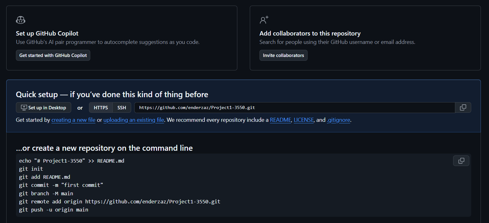
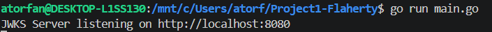

# JWKS Server

A RESTful HTTP server in Go that provides public keys via JSON Web Key Sets (JWKS) and issues signed JSON Web Tokens (JWTs).

## Features
- Serves active public RSA keys at `GET /.well-known/jwks.json`.
- Issues signed JWTs at `POST /auth`.
- Supports testing expired key handling via `POST /auth?expired=true`.
- Includes unit tests with `net/http/httptest`.

## Setup & Execution

### Prerequisites
- Go 1.20+

### Installation
```bash

### Test Suite & Code Coverage


### Test Client Execution
